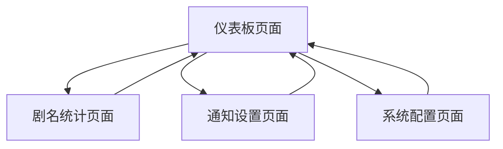

# RSS影视剧监控工具产品需求文档

## 1. Product Overview
一个基于Docker的RSS信息统计工具，专门用于监控影视剧资源更新并提供智能通知服务。
- 解决影视剧爱好者需要手动检查RSS更新的问题，自动识别新出现的剧名并及时通知用户。
- 目标用户为影视剧追踪者和资源管理员，提供高效的内容监控和通知服务。

## 2. Core Features

### 2.1 User Roles
本产品采用单用户模式，无需复杂的用户角色区分。

### 2.2 Feature Module
我们的RSS影视剧监控工具包含以下主要页面：
1. **仪表板页面**：RSS源管理、监控状态显示、统计数据概览
2. **剧名统计页面**：已发现剧名列表、新增剧名记录、搜索过滤功能
3. **通知设置页面**：Telegram/Discord配置、通知规则设定、测试功能
4. **系统配置页面**：RSS源配置、监控频率设置、数据管理

### 2.3 Page Details

| Page Name | Module Name | Feature description |
|-----------|-------------|---------------------|
| 仪表板页面 | RSS源管理 | 添加、编辑、删除RSS源链接，支持多个RSS源同时监控 |
| 仪表板页面 | 监控状态显示 | 实时显示各RSS源的监控状态、最后更新时间、连接状态 |
| 仪表板页面 | 统计数据概览 | 显示总剧名数量、今日新增、本周新增等关键指标 |
| 剧名统计页面 | 剧名列表 | 展示所有已发现的影视剧名称，包括首次发现时间、出现频次 |
| 剧名统计页面 | 新增记录 | 按时间顺序显示新发现的剧名，支持标记为已读/未读 |
| 剧名统计页面 | 搜索过滤 | 按剧名关键词、发现时间、类型等条件筛选和搜索 |
| 通知设置页面 | 平台配置 | 配置Telegram Bot Token、Discord Webhook等通知渠道参数 |
| 通知设置页面 | 通知规则 | 设置通知触发条件、消息模板、发送频率限制 |
| 通知设置页面 | 测试功能 | 发送测试消息验证通知配置是否正确 |
| 系统配置页面 | RSS配置 | 管理RSS源URL、解析规则、更新间隔等参数 |
| 系统配置页面 | 数据管理 | 数据备份、清理历史记录、导入导出功能 |

## 3. Core Process

主要用户操作流程：
1. 用户首先在系统配置页面添加RSS源链接
2. 在仪表板查看监控状态和统计概览
3. 在通知设置页面配置Telegram或Discord通知
4. 系统自动监控RSS更新，发现新剧名时发送通知
5. 用户在剧名统计页面查看详细的发现记录和统计信息

## 4. User Interface Design

### 4.1 Design Style
- 主色调：深蓝色(#2563eb)，辅助色：浅灰色(#f8fafc)
- 按钮样式：圆角按钮，悬停效果，现代扁平化设计
- 字体：系统默认字体，标题16px，正文14px，小字12px
- 布局风格：卡片式布局，顶部导航栏，响应式设计
- 图标风格：简洁的线性图标，统一的视觉风格

### 4.2 Page Design Overview

| Page Name | Module Name | UI Elements |
|-----------|-------------|-------------|
| 仪表板页面 | RSS源管理 | 卡片式布局，每个RSS源一个卡片，包含状态指示器、操作按钮 |
| 仪表板页面 | 统计数据概览 | 数字仪表盘样式，大号数字显示，配色区分不同指标 |
| 剧名统计页面 | 剧名列表 | 表格布局，支持排序，新剧名高亮显示，分页加载 |
| 通知设置页面 | 平台配置 | 表单布局，输入框验证，保存状态提示 |
| 系统配置页面 | RSS配置 | 列表+表单组合，支持拖拽排序，实时预览 |

### 4.3 Responsiveness
采用移动端优先的响应式设计，支持桌面端和移动端访问，优化触摸交互体验。